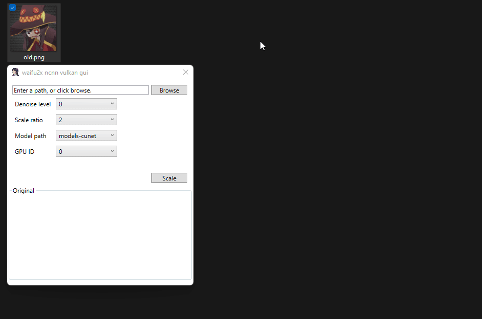

# waifu2x-ncnn-gui

<!-- # Short Description -->

GUI Frontend for [waifu2x-ncnn-vulkan](https://github.com/nihui/waifu2x-ncnn-vulkan)

<!-- # Badges -->

# Tags

`upscale` `waifu2x` `anime` `gui` `dotnet6`

# Advantages

- Easy installation
- Much simpler to use than a command line

# Installation

1. Download latest [waifu2x-ncnn-vulkan](https://github.com/nihui/waifu2x-ncnn-vulkan/releases/latest)
2. Download latest [waifu2x-ncnn-gui](https://github.com/Avellea/waifu2x-ncnn-gui/releases/latest)
3. Drop all contents of `waifu2x-ncnn-gui` into `waifu2x-ncnn-vulkan`
4. Start `waifu2x-ncnn-gui.exe`

# Minimal Example

# Contributors

- [Avellea](https://github.com/Avellea)

<!-- CREATED_BY_LEADYOU_README_GENERATOR -->